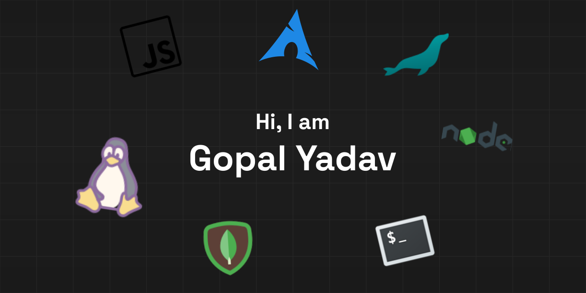

I’m a final-year Computer Science student focused on building web systems with strong fundamentals in backend and Frontend development, Linux, and Design

I enjoy Learning about the Working of Every System I work on in depth as it gives me an opportunity to grow and expand my knowledge

---

### What I care about

- Backend and API design.
- Practial and Good looking Frontend along with their design
- Understanding the machine I work on.
- Linux Based Systems
- Mentoring and technical leadership

### Currently focused on

- Learning how Linux works
- Improving SwiftSlots (constraints, performance)
- Improving my knowledge base on how to scale systems.

### Tech I work with

**Languages:** C++, Java, Python, JavaScript  
**Frontend:** React, HTML, CSS  
**Backend:** Node.js, Express, REST APIs  
**Databases:** MySQL / MariaDB, Firebase  
**Systems & Tools:** Linux, Git, Bash

### Selected work

**SwiftSlots** — constraint-based timetable generation system  
**IEEE Enrollment Platform** — full-stack enrollments management system

### Connect

- LinkedIn:
- Email: …
